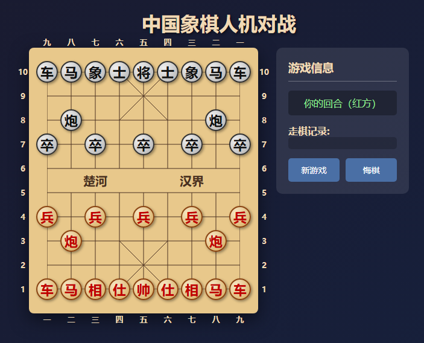

# 中国象棋人机对战

中国象棋人机对战程序，使用 Pikafish 引擎作为 AI 对手。
提供两种版本：命令行版和网页版。



## 网页版（推荐）

### 启动服务器

```bash
python server.py
```

### 打开浏览器

访问 http://localhost:8080

### 操作方式

- **点击**己方棋子（红色）选中
- **点击**目标位置移动
- 支持悔棋、新游戏

## 命令行版

### 运行方法

```bash
python chess.py
```

### 走法输入格式

使用坐标格式：**列行 - 列行**

- 列：从右到左为 1-9
- 行：从下到上为 1-10

### 示例

- `32-36`：炮二平五
- `73-74`：进 7 路卒

## 棋盘说明

```
  九 八 七 六 五 四 三 二 一
  a  b  c  d  e  f  g  h  i
  ┌───┬───┬───┬───┬───┬───┬───┬───┬───┐
10 │ 车 │ 马 │ 象 │ 士 │ 将 │ 士 │ 象 │ 马 │ 车 │ 10  (黑方 - AI)
  ...
  ├───┴───┴───┴───┴───┴───┴───┴───┴───┤ 楚河        汉界
  ...
1 │ 车 │ 马 │ 相 │ 仕 │ 帅 │ 仕 │ 相 │ 马 │ 车 │ 1   (红方 - 玩家)
  └───┴───┴───┴───┴───┴───┴───┴───┴───┘
```

- **红方（玩家）**：下方，先行
- **黑方（AI）**：上方

## 依赖

- Python 3.x
- Pikafish 引擎（需自行下载）

## 引擎文件下载

由于引擎文件较大（约 200MB），未包含在 Git 仓库中。请自行下载：

1. **Pikafish 引擎**：从 [Pikafish  releases](https://github.com/nathanntg/pikafish/releases) 下载 Windows 版本
2. **NNUE 文件**：下载 `pikafish.nnue`

将下载的文件放入项目目录：
```
minicchess/
  ├── pikafish-sse41-popcnt.exe  # 引擎
  ├── pikafish.nnue              # 神经网络文件
  ├── server.py
  ├── chess.py
  └── index.html
```
